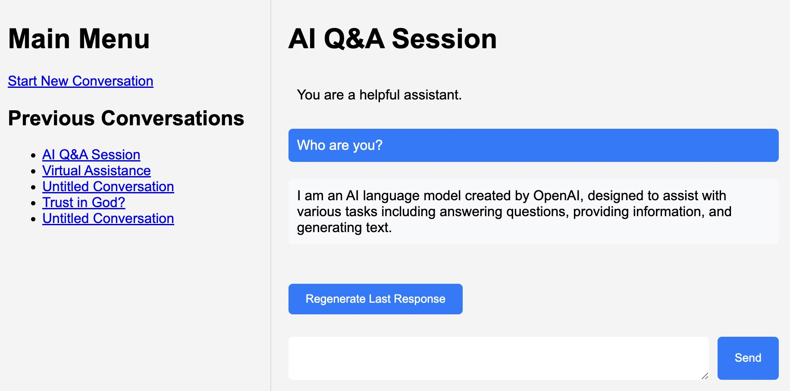

# OpenAI Chat Web Application

## Overview

This is a web application that closely replicates the functionality of chat.openai.com. The application was developed and documented primarily by GPT-4 in less than 3 hours. It allows users to interact with the GPT-4 model in a chat-like interface, with the ability to start new conversations, view previous conversations, and regenerate the last response.



## Setup

To set up the project, follow these steps:

1. Clone the repository to your local machine.
2. Install the required Python packages using pip:

    ```
    pip install -r requirements.txt
    ```

3. Set up your environment variables. You'll need to set `OPENAI_API_KEY`, `WHITELISTED_IPS`, `OPENAI_ORGANIZATION`, and `FLASK_SECRET_KEY`. You can do this in a `.env` file:

    ```
    OPENAI_API_KEY=your_openai_api_key
    WHITELISTED_IPS=127.0.0.1,another_whitelisted_ip
    OPENAI_ORGANIZATION=your_openai_organization
    FLASK_SECRET_KEY=your_flask_secret_key
    ```


4. Initialize the database. First, make sure you're in the same directory as app.py. Then, run the following commands:
    ```
    flask db init
    flask db migrate
    flask db upgrade
    ```

5. Run the Flask application:

    ```
    flask run
    ```

## Functionality

The application has the following features:

- **Main Menu:** The main menu lists all previous conversations and allows the user to start a new conversation.
- **Chat Interface:** The chat interface allows the user to interact with the GPT-4 model. The user can type a message, send it, and receive a response from the model. The user's messages and the model's responses are displayed in the chat interface.
- **Regenerate Last Response:** The user can regenerate the last response from the model. This deletes the last response and generates a new one.
- **IP Whitelisting:** The application can be configured to only allow access from certain IP addresses. This is done using the `WHITELISTED_IPS` environment variable.

## Models

The application uses two models, `Conversation` and `Message`:

- **Conversation:** Represents a conversation between the user and the GPT-4 model. Each conversation has a title and a list of messages.
- **Message:** Represents a message in a conversation. Each message has a role (either "user" or "assistant"), content, and a reference to the conversation it belongs to.
